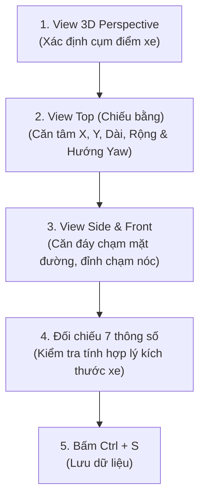

# Hướng Dẫn Thực Hiện Lab 12: Gán Nhãn 3D Cuboid Trên Point Cloud LiDAR (Từ Đầu Đến Lúc Nộp)

Tài liệu này hướng dẫn chi tiết quy trình thực hành **Day 12 Lab — 3D Bounding Box (Cuboid) Annotation on LiDAR Point Cloud** thuộc chương trình đào tạo kỹ sư AI xe tự hành VinAI / VinUni.

---

## 1. Tổng Quan & Mục Tiêu Lab 12

### 1.1. Bản chất bài toán gán nhãn 3D Cuboid
- **LiDAR Point Cloud (Đám mây điểm)**: Dữ liệu không gian 3 chiều phản xạ từ cảm biến LiDAR gắn trên nóc xe tự hành, thể hiện cấu trúc hình học thực tế của môi trường.
- **3D Cuboid**: Hộp giới hạn 3 chiều định danh vật thể với **7 tham số cốt lõi**:
  $$\text{Cuboid} = \{ \text{Class}, x, y, z, \text{Length}, \text{Width}, \text{Height}, \text{Yaw} \}$$
  Trong đó:
  - $(x, y, z)$: Tọa độ tâm hình học 3D của chiếc xe thật.
  - $(\text{Length}, \text{Width}, \text{Height})$: Chiều dài, chiều rộng, chiều cao xe thật.
  - $\text{Yaw}$ ($\theta$): Góc xoay hướng di chuyển quanh trục thẳng đứng $Z$.

### 1.2. Mục tiêu bắt buộc cần đạt
1. **Phạm vi không gian**: Quét toàn bộ vùng vuông **$50\text{ m} \times 50\text{ m}$** quanh xe thu dữ liệu.
2. **Đối tượng gán nhãn**: Nhãn **`vehicles`** cho **toàn bộ xe từ 4 bánh trở lên** (ô tô con, SUV, bán tải, van, xe tải, xe buýt). Mỗi frame có khoảng **$8 \to 19$ xe**.
3. **Số lượng hoàn thành**: Gán nhãn đầy đủ **cả 3 Job** được giao. Ba job có tỷ trọng điểm ngang nhau.
4. **Không nộp file trung gian**: Toàn bộ thao tác thực hiện trực tiếp trên server CVAT Online của VinAI; giảng viên chấm tự động theo bản Save cuối cùng trên server.

---

## 2. Hướng Dẫn Truy Cập CVAT Online VinAI

> [!IMPORTANT]
> Dữ liệu LiDAR và Camera là dữ liệu thật từ đội xe VinFast Robotaxi, tuân thủ nghiêm ngặt quy chế bảo mật: Tuyệt đối không chụp màn hình chứa dữ liệu điểm hoặc ảnh camera để chia sẻ ra ngoài.

1. **Địa chỉ truy cập**: Mở trình duyệt (khuyến nghị Google Chrome hoặc Microsoft Edge mới nhất) truy cập:  
   👉 **[https://cvat.note.transformerlabs.ai](https://cvat.note.transformerlabs.ai)**
2. **Tài khoản đăng nhập**:
   - **Username**: Mã số sinh viên VinAI của bạn: `2A202602300`
   - **Password**: Mật khẩu lớp đã cấp.
3. **Chuyển Organization (Bắt buộc)**:
   - Nhấp vào **Tên tài khoản / Avatar** ở góc trên cùng bên phải.
   - Chọn chuyển sang Organization: **`ai20k-labs`**.  
   *(Nếu ở Personal Workspace, danh sách Jobs sẽ trống hoàn toàn).*
4. **Vào Job làm bài**:
   - Chọn thẻ **Jobs** trên thanh điều hướng (không mở thẻ *Tasks* vì bạn không có quyền admin của cả task).
   - Bạn sẽ thấy đúng **3 Job** được giao. Nhấp vào từng thẻ job để bắt đầu thực hiện.

---

## 3. Bảng Phím Tắt Vàng Điều Khiển 3D Camera & Thao Tác CVAT

Làm việc trong không gian 3D đòi hỏi thao tác liên tục giữa chuột và bàn phím để di chuyển góc nhìn (Pan/Zoom/Orbit).

### 3.1. Phím tắt điều khiển Camera 3D (Theo chuẩn VinAI Lab)

| Thao tác điều khiển (Action Description) | Phím tắt Windows (Windows Shortcut) | Phím tắt macOS (Mac Shortcut) | Ý nghĩa thao tác |
| :--- | :---: | :---: | :--- |
| **Move camera left** | `Alt + J` | `Option (⌥) + J` | Di chuyển góc nhìn camera sang trái |
| **Move camera right** | `Alt + L` | `Option (⌥) + L` | Di chuyển góc nhìn camera sang phải |
| **Move camera up** | `Alt + O` | `Option (⌥) + O` | Di chuyển góc nhìn camera lên trên |
| **Move camera down** | `Alt + U` | `Option (⌥) + U` | Di chuyển góc nhìn camera xuống dưới |
| **Zoom in** | `Alt + I` | `Option (⌥) + I` | Phóng to vào tâm đối tượng |
| **Zoom out** | `Alt + K` | `Option (⌥) + K` | Thu nhỏ góc nhìn ra xa |

### 3.2. Thao tác chuột trong không gian 3D
- **Xoay góc nhìn (Orbit)**: Giữ `Chuột trái` và rê chuột để xoay quanh điểm ngắm.
- **Trượt không gian (Pan)**: Giữ `Chuột phải` hoặc `Shift + Chuột trái` để tịnh tiến góc nhìn song song.
- **Thu phóng (Zoom)**: Cuộn `Con lăn chuột` tiến/lùi.
- **Đặt tâm xoay mới**: Nhấp đúp `Chuột trái` vào một điểm bất kỳ trên đám mây điểm để đưa điểm đó thành tâm xoay của camera.

### 3.3. Phím tắt vẽ và chỉnh sửa Cuboid
- `N`: Bắt đầu tạo mới một cuboid 3D.
- `Ctrl + S`: Lưu bài làm ngay lập tức (**bắt buộc bấm thường xuyên** tránh mất dữ liệu khi trình duyệt tải nặng).
- `Del` hoặc `Backspace`: Xóa hộp được chọn.
- `Esc`: Thoát khỏi chế độ vẽ/sửa hiện tại.

---

## 4. Quy Trình 4 View Chuẩn Công Nghiệp (Four-View Workflow)

Giao diện CVAT 3D cung cấp cửa sổ chính 3D Perspective cùng 3 khung hình chiếu trực giao (**Top, Side, Front**). **Quy tắc vàng: Không bao giờ chốt kích thước hộp ở view 3D, chỉ tinh chỉnh trên 3 view trực giao.**

### Bước 1: View 3D Perspective — Định vị cụm điểm
- Xoay và zoom trong không gian 3D để nhận diện cụm điểm phản xạ hình chữ L hoặc hộp của xe.
- Đặt một cuboid nhãn `vehicles` lên cụm điểm.

### Bước 2: View Top (Từ trên xuống) — Căn chỉnh mặt bằng & Hướng xe
- **Tâm $(x, y)$**: Kéo tâm hộp vào giữa thân xe thật.
- **Chiều dài & Chiều rộng**: Kéo 4 cạnh bao phủ toàn bộ thân xe.
- **Xoay hướng (Yaw)**: 
  - Vào panel bên phải: **Appearance** $\to$ Tích chọn **`Cuboid orientation`**.
  - Xoay cạnh dài song song với thân xe sao cho **Mũi tên đỏ chỉ thẳng về đầu xe** (theo chiều di chuyển).

### Bước 3: View Side & View Front — Căn chỉnh cao độ & Chiều cao
- **Đáy hộp**: Kéo mép đáy hộp chạm đúng mặt đường ngay dưới vết tiếp xúc của bánh xe. Không để hộp lơ lửng trên không và không để hộp chìm sâu dưới mặt đường.
- **Nắp hộp**: Kéo nắp trên chạm điểm cao nhất của thân xe (nóc xe, không tính ăng-ten mảnh).

### Bước 4: Kiểm tra lại 7 thông số & Lưu bài
- Đọc lại thông số kích thước: Chiều dài, chiều rộng, chiều cao có hợp lý với xe thật không?
- Nhấn `Ctrl + S` để lưu lại.

---

## 5. Quy Chuẩn Kích Thước & Nhận Diện Hướng Xe

### 5.1. Bảng kích thước xe tham khảo (Đo từ bộ dữ liệu thật)

| Phân loại xe | Chiều dài (Length) | Chiều rộng (Width) | Chiều cao (Height) | Dấu hiệu nhận diện |
| :--- | :---: | :---: | :---: | :--- |
| **Ô tô con (Sedan, Hatchback)** | $3.8 \to 4.8\text{ m}$ | $1.7 \to 1.9\text{ m}$ | $1.4 \to 1.6\text{ m}$ | Thân thấp, vuốt đuôi |
| **SUV / Crossover / Bán tải** | $4.4 \to 5.2\text{ m}$ | $1.8 \to 2.2\text{ m}$ | $1.6 \to 2.0\text{ m}$ | Gầm cao, đuôi đứng hoặc thùng hàng |
| **Xe tải nhỏ / Van chở hàng** | $4.8 \to 5.5\text{ m}$ | $2.0 \to 2.4\text{ m}$ | $2.4 \to 3.0\text{ m}$ | Cabin đứng, thùng kín hoặc hở |
| **Xe buýt / Xe tải lớn** | $8.0 \to 12.0\text{ m}$ | $2.4 \to 2.6\text{ m}$ | $3.0 \to 3.6\text{ m}$ | Khối hộp dài, cụm điểm dày đặc |

> [!WARNING]
> **Hiện tượng co hộp theo điểm (Far-car Shrinking Trap)**:  
> LiDAR chỉ bắn trúng 1 hoặc 2 mặt của xe quay về phía cảm biến. Xe ở xa điểm rất thưa. **Tuyệt đối không vẽ hộp co cụm quanh vài điểm nhìn thấy** (ví dụ ô tô mà dài 2m, rộng 1m là sai). Bạn phải kéo hộp nở rộng đủ kích thước của xe thật theo bảng trên!

### 5.2. Nhận diện đầu xe (Tránh lỗi lật ngược 180°)
- **Cùng chiều chạy**: Xe chạy cùng làn với xe thu dữ liệu có mũi tên chỉ cùng hướng với chiều quan sát.
- **Ngược chiều chạy**: Xe ở làn ngược chiều có mũi tên chỉ ngược lại.
- **Xe đỗ ven đường**: Mở ảnh Camera hỗ trợ bên cạnh để nhìn đèn pha trước, kính chắn gió trước, biển số trước.
- **Quy tắc tuyệt đối**: **Mũi tên đỏ PHẢI chỉ về đầu xe**, không bao giờ được chỉ về phía đuôi xe.

### 5.3. Tính nhất quán kích thước xuyên suốt 3 Job
- Cả 3 Job lấy từ cùng một đoạn đường liên tiếp cách nhau vài giây. Rất nhiều xe xuất hiện lặp lại ở cả 3 Job (xe chạy cùng tốc độ hoặc xe đỗ ven đường).
- **Nguyên tắc**: Xe không tự co giãn kích thước. Khi gặp lại cùng một chiếc xe ở Job sau:
  - Giữ nguyên bộ thông số: **Dài × Rộng × Cao** của xe đó từ Job trước (chênh lệch cho phép $< 10\%$).
  - Chỉ dời tọa độ tâm $(x, y, z)$ và xoay hướng $\text{Yaw}$ tương ứng với vị trí mới.

---

## 6. Phân Tích Rubric 100 Điểm & 2 Bẫy Chặn Trần Điểm

Hệ thống của giảng viên chấm tự động bằng thuật toán Hungarian Matching đối chiếu với Ground Truth độ chính xác cao.

### 6.1. Cơ cấu 6 hạng mục chấm điểm

| Hạng mục | Điểm | Công thức & Tiêu chí | Sai sót dẫn đến mất điểm |
| :--- | :---: | :--- | :--- |
| **1. Tỷ lệ phát hiện** | **30 đ** | $\frac{\text{Số xe ghép được}}{\text{Số xe Ground Truth}} \times 30$ | Bỏ sót xe trong vùng $50\text{m} \times 50\text{m}$, sót xe ở mép viền, xe bị che khuất |
| **2. Chất lượng hộp** | **30 đ** | Tâm lệch $\le 0.25\text{m}$ (đủ điểm), $\le 0.5\text{m}$ (0.3đ); Kích thước sai $\le 20\%$ | Co hộp theo mảng điểm, đặt tâm lệch, sai kích thước thực |
| **3. Độ chính xác hướng** | **15 đ** | Góc Yaw lệch $\le 5^\circ$ (đủ điểm), $\le 10^\circ$ (0.6đ); Lệch $> 10^\circ$ hoặc lật đầu (0đ) | Xoay lệch hướng di chuyển, lật ngược 180° |
| **4. Đáy chạm mặt đường** | **5 đ** | Đáy hộp lệch $\le 0.2\text{m}$ so với mặt đường dưới bánh xe | Đáy lơ lửng trên không hoặc cắm sâu dưới lòng đất |
| **5. Không vẽ thừa** | **10 đ** | $\frac{\text{Số xe ghép được}}{\text{Tổng số hộp vehicles đã vẽ}} \times 10$ | Vẽ hộp vào khoảng trống vô nghĩa, vẽ hộp `vehicles` lên xe máy |
| **6. Nhất quán kích thước** | **10 đ** | Số xe giữ nguyên kích thước (sai số $< 10\%$) qua các Job / Tổng xe lặp lại | Cùng một chiếc xe nhưng mỗi Job lại vẽ kích thước khác nhau |
| **TỔNG ĐIỂM** | **100 đ** | **Điểm A: $\ge 90$ \| Điểm B: $\ge 80$ \| Điểm C: $\ge 70$** | |

### 6.2. Hai "Bẫy Tử Thần" bị Chặn Trần Điểm (Critical Caps)
Chỉ áp dụng với các xe ở cự ly gần (**dưới 15 mét** quanh xe thu dữ liệu):

| Lỗi nghiêm trọng ở cự ly gần (< 15 m) | Hình phạt chặn trần |
| :--- | :---: |
| **Lật ngược đầu xe 180° dù chỉ duy nhất 1 xe gần** | **CẢ BÀI TỐI ĐA 70 ĐIỂM (Không thể đạt A, B)** |
| **Bỏ sót trên 10% số lượng xe gần** | **CẢ BÀI TỐI ĐA 60 ĐIỂM (Tối đa điểm D)** |
| **Dính cả hai lỗi trên** | **CẢ BÀI BỊ CHẶN TRẦN 60 ĐIỂM** |

---

## 7. Checklist Kiểm Tra Trước Khi Bấm "Completed" & Nộp Bài

Thực hiện rà soát nghiêm túc từng mục sau cho **cả 3 Job**:

- [ ] **Bao phủ 100%**: Đã quét toàn bộ vùng $50\text{ m} \times 50\text{ m}$, không bỏ sót bất kỳ xe nào (kể cả xe ở sát mép viền, xe bị xe khác che khuất, xe chạy ngược chiều).
- [ ] **Đúng lớp đối tượng**: Toàn bộ các hộp vẽ đều mang nhãn **`vehicles`**. (Không dùng nhãn `vehicles` cho xe máy/xe đạp).
- [ ] **Mũi tên đỏ chỉ về đầu xe**: Soát lại 100% các hộp ở **View Top**, đảm bảo mũi tên đỏ chỉ thẳng về hướng đầu xe, **tuyệt đối không bị lật 180°**.
- [ ] **Kích thước xe thật**: Các xe ở xa đã được mở rộng hộp đầy đủ kích thước xe thật, không bị co cụm theo cụm điểm.
- [ ] **Đáy chạm đường**: Đã kiểm tra ở View Side/Front, đáy hộp nằm khít mặt đường dưới bánh xe.
- [ ] **Không vẽ thừa**: Không có hộp rác nào vẽ vào khoảng trống không có xe.
- [ ] **Đồng nhất kích thước**: Các xe quen thuộc xuất hiện ở Job trước được giữ nguyên kích thước ở Job sau.
- [ ] **Save dữ liệu**: Đã bấm `Ctrl + S` lưu bản vẽ cuối cùng.
- [ ] **Chuyển trạng thái**: Bấm vào trạng thái Job chuyển từ *in progress* $\to$ **`completed`**.

---

Chúc bạn hoàn thành xuất sắc bài thực hành Day 12 và đạt điểm A tuyệt đối!
